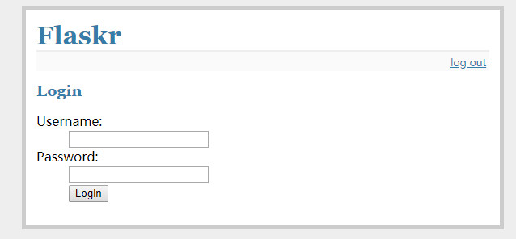
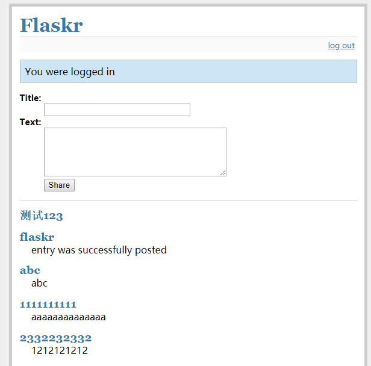

# flaskr
Flask 文档实例，快速学习 flask 框架应用。

----------

#运行

python app.py

#模块

import os

import sqlite3

from flask import Flask, request, session, g, redirect, url_for, abort, \
     render_template, flash

from contextlib import closing

#应用知识点
1.创建 sqlite 数据库

E:\jetbrains\flaskr>sqlite3 flaskr.db < schema.sql

2.链接 sqlite

with app.open_resource('schema.sql') as f:

3.应用 flask 路由解析

@app.route('/add', methods=['POST'])

#效果展示

